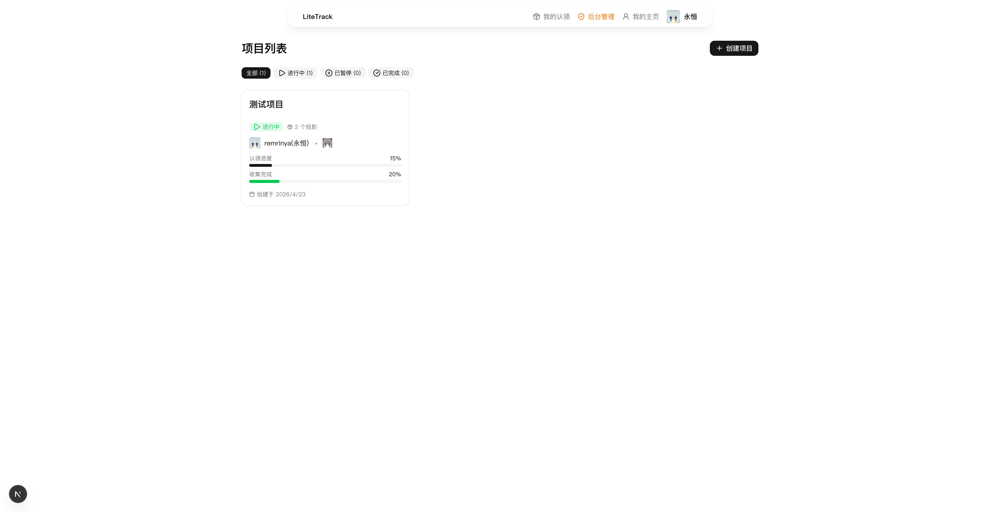
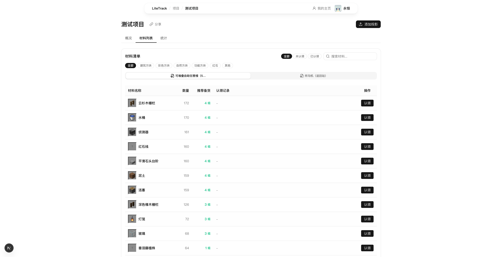
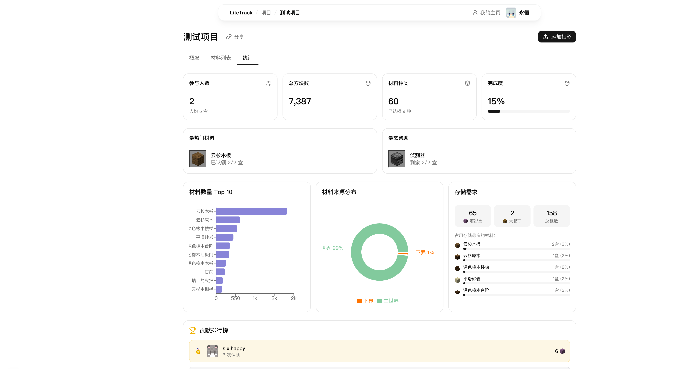
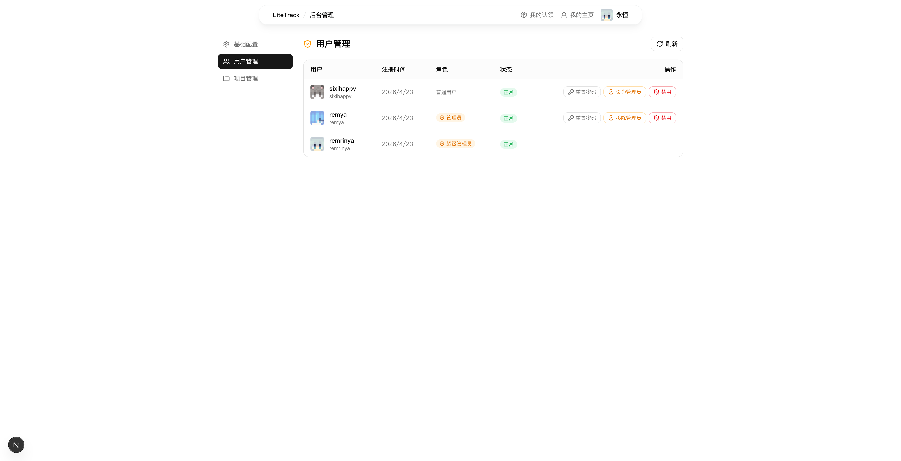
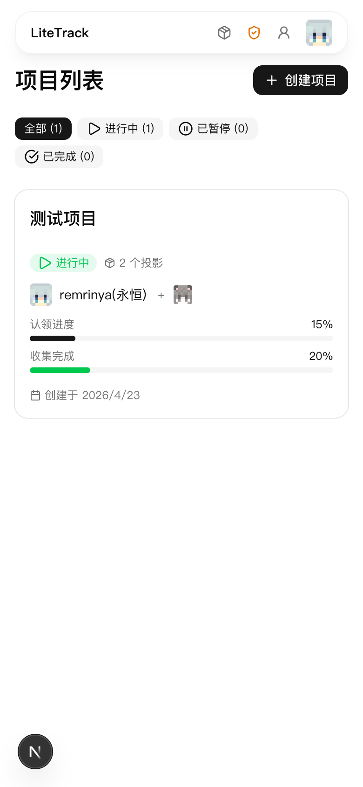
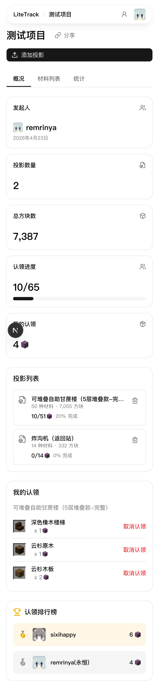
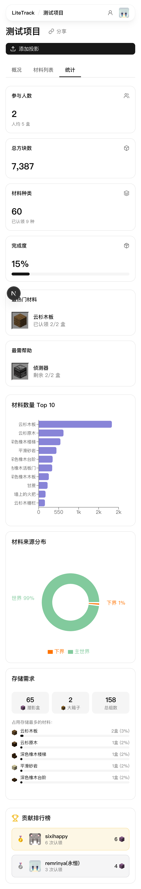

<div align="center">

# 🧱 LiteTrack

**Minecraft 建筑材料协作追踪平台**

上传 `.litematic` 投影文件，团队成员在线认领材料、追踪收集进度。

[](https://www.gnu.org/licenses/gpl-3.0)
[](https://nextjs.org)
[](https://react.dev)
[](https://www.typescriptlang.org)
[](https://tailwindcss.com)
[](https://sqlite.org)
[](https://hub.docker.com)

</div>

---

## ✨ 功能特性

| 功能 | 描述 |
|------|------|
| 📦 **投影解析** | 上传 `.litematic` 文件，自动解析所有方块材料用量 |
| 👥 **协作认领** | 按潜影盒为单位认领材料，防止重复收集 |
| 📊 **实时统计** | 项目认领进度、收集完成度、排行榜与图表 |
| 🗂️ **多投影支持** | 单项目支持多个 `.litematic` 文件，分 Tab 管理 |
| 🔐 **白名单注册** | 仅白名单内的 MC 玩家名可注册，支持批量导入 EasyAuth 数据 |
| 🛡️ **管理后台** | 用户管理、角色权限、密码重置 |
| 🎨 **皮肤头像** | 自动获取 Minecraft 玩家头像 |
| 🌙 **深色模式** | 跟随系统或手动切换 |
| 📱 **移动端适配** | 全页面响应式布局 |

---

## 📸 截图





<details>
<summary>更多截图</summary>

**统计图表**


**管理后台**


**移动端项目列表**


**移动端材料认领**


**移动端统计图表**


</details>

---

## 🚀 快速部署（Docker）

> **前提：** 已安装 [Docker](https://docs.docker.com/get-docker/)

```bash
# 1. 新建目录并下载配置文件
mkdir litetrack && cd litetrack
curl -O https://raw.githubusercontent.com/xgenya/litetrack/master/docker-compose.yml
curl -O https://raw.githubusercontent.com/xgenya/litetrack/master/.env.example
cp .env.example .env

# 2. 编辑 .env，设置你的 MC 用户名为管理员
#    ADMIN_USERNAMES=你的MC名
nano .env

# 3. 启动
mkdir -p data
docker compose up -d
```

访问 `http://localhost:3000`，用设置的 MC 用户名注册即可获得管理员权限。

### 管理容器

```bash
# 更新到最新版本
docker compose pull && docker compose up -d

# 查看日志
docker logs litetrack

# 停止
docker compose down
```

数据库文件保存在 `./data/litematic.db`。

---

## 🛠️ 本地开发

```bash
# 安装依赖
npm install

# 配置环境变量
cp .env.example .env

# 启动开发服务器
npm run dev
```

访问 `http://localhost:3000`。

---

## ⚙️ 环境变量

| 变量 | 默认值 | 说明 |
|------|--------|------|
| `ADMIN_USERNAMES` | —（无） | 预设管理员 MC 用户名，多个用逗号分隔 |
| `COOKIE_SECURE` | `false` | Cookie Secure 标志；HTTPS 部署设为 `true` |
| `DB_PATH` | `data/litematic.db` | SQLite 数据库文件路径 |

---

## 🏗️ 技术栈

- **框架：** [Next.js 16](https://nextjs.org) (App Router) + [React 19](https://react.dev)
- **数据库：** [better-sqlite3](https://github.com/WiseLibs/better-sqlite3) (SQLite)
- **样式：** [Tailwind CSS 4](https://tailwindcss.com) + [shadcn/ui](https://ui.shadcn.com)
- **图表：** [Recharts](https://recharts.org)
- **投影解析：** [nbt-ts](https://github.com/janispritzkau/nbt-ts) + [pako](https://github.com/nodeca/pako)
- **材料图标：** [minecraft-textures](https://github.com/destruc7i0n/minecraft-textures)

---

## 📄 License

本项目基于 [GNU General Public License v3.0](LICENSE) 开源。
